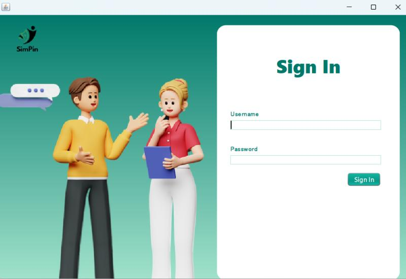
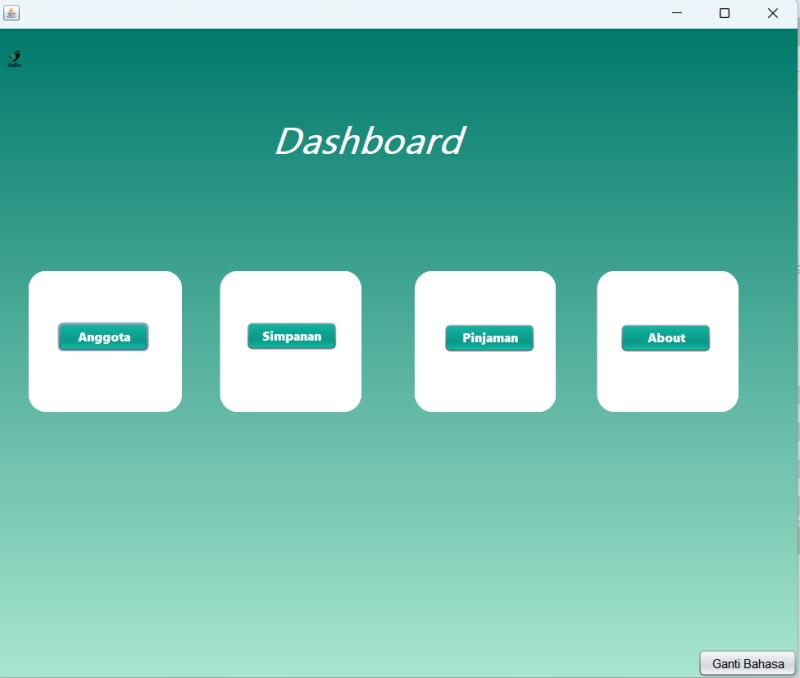
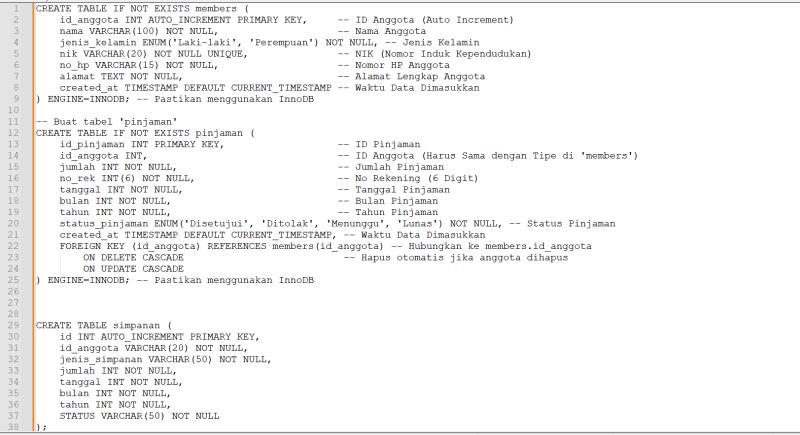
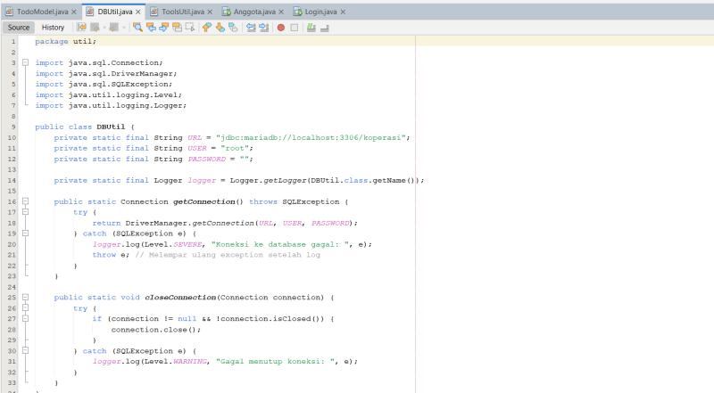

# 💼 Aplikasi SimPin - Backend Java (Desktop Simpan Pinjam)

**SimPin** adalah aplikasi backend berbasis Java untuk manajemen simpan pinjam koperasi. Dibuat menggunakan **Java 23** dan dikembangkan di **NetBeans**, aplikasi ini dirancang untuk memberikan solusi manajemen keuangan koperasi kecil dengan fitur login, transaksi pinjam-simpan, night mode, dan multi-language support.

---

## 🚀 Fitur Utama

- 🔐 **Login & Autentikasi** pengguna koperasi
- 👥 **Manajemen Anggota**: Tambah, lihat, ubah, dan hapus anggota
- 💸 **Transaksi Simpanan & Pinjaman** per anggota
- 🌙 **Night Mode** dan 🔁 **Change Language** (multi-bahasa)
- 📋 **Laporan Simpanan**: Menampilkan laporan data tabungan
- 📁 **Struktur Modular**: Entity, Repository, Model, View, Component
- 🛠️ **DB Utility**: Koneksi ke MariaDB melalui helper `DBUtil`
- 🎨 **UI Desktop (Java Swing)** dengan ikon dan resource terkelola

---

## 🧱 Teknologi yang Digunakan

| Teknologi        | Deskripsi                                    |
|------------------|----------------------------------------------|
| **Java 23**       | Bahasa utama untuk pengembangan aplikasi     |
| **Swing GUI**     | Antarmuka pengguna berbasis desktop (form UI)|
| **MariaDB**       | Basis data relasional                       |
| **Ant (build.xml)**| Alat build untuk compile dan run project   |
| **NetBeans IDE**  | Lingkungan pengembangan utama               |

---

## 📸 Screenshot Aplikasi

### 🔑 Login

### 🖥️ Dashboard (Versi Bahasa Indonesia)

### 🌐 Dashboard (Versi English)

### ➕ Tambah Anggota

### 🧠 Database MariaDB (Relasi)

### 🔧 Kode DBUtil.java (Koneksi Database)

